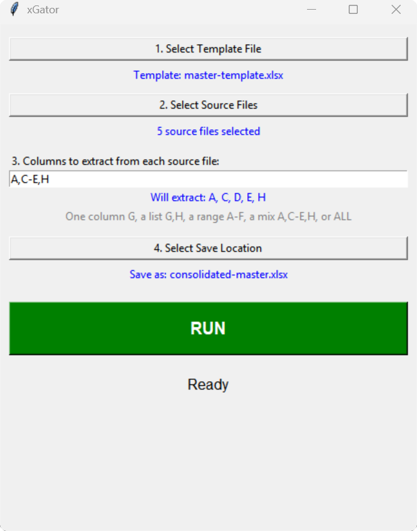
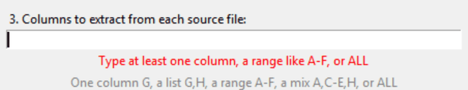

# xGator

>Desktop app that pulls chosen columns from many Excel workbooks into one master workbook. Pick a template, pick the source files, type the columns, press RUN.

 

| Runs on | Windows, Linux, macOS |
| --- | --- |

 

---

 

## Download and run

| OS      | Action                                                                                                                                                         |
| ------- | -------------------------------------------------------------------------------------------------------------------------------------------------------------- |
| Windows | Download [xGator.exe](xGator/xGator.exe), put it in any folder, and double-click it. SmartScreen warns once on the first run because the exe is unsigned       |
| Linux   | Download this repo. Install Tk with `sudo apt install python3-tk`, then the libraries with `pip install -r requirements.txt`. Then run `python3 aggregator.py` |
| macOS   | Download this repo. Install the libraries with `pip3 install -r requirements.txt`, then run `python3 aggregator.py`                                            |

 

---

 

## The window

| Step | Button               | Description                                                                                                               |
| ---- | -------------------- | ------------------------------------------------------------------------------------------------------------------------- |
| 1    | Select Template File | The master workbook the results are written into. The tool copies it first and writes only to the copy                    |
| 2    | Select Source Files  | The workbooks the columns come from. Many files can be picked at once                                                     |
| 3    | Columns to extract   | Type the columns to pull. The field checks the text as you type. Blue means the text is valid, red means it is not        |
| 4    | Select Save Location | The path of the finished master workbook                                                                                  |
| RUN  | RUN                  | Copies the template, writes every source file's chosen columns into the copy side by side, then offers to open the result |

Made with [VtG](https://github.com/Fabian-Galvez/VtG), which lists every gif it has made in [GIFS.md](https://github.com/Fabian-Galvez/VtG/blob/main/GIFS.md).

 

---

 

## Column names
| Typed     | Pulled                               |
| --------- | ------------------------------------ |
| `G`       | one column                           |
| `G,H`     | those columns, side by side          |
| `A-F`     | the range                            |
| `A,C-E,H` | any mix of single columns and ranges |
| `ALL`     | every used column, per source file   |

Each source file's columns are written into the next free block of the master, left to right in file order.

 

---

 

## Origin
| Fact          | Detail                                                                                                       |
| ------------- | ------------------------------------------------------------------------------------------------------------ |
| Built for     | The QA team at a CNC machine shop. Every machined part has its own workbook of measurements                  |
| Old method    | Copy two columns out of up to hundreds of workbooks by hand into a master workbook. Over an hour per project |
| With the tool | About 5 minutes per project                                                                                  |
| In production | Runs daily with zero support tickets raised against it                                                       |

 

---

 

## More

| Link                                             | Description                                                                        |
| ------------------------------------------------ | ---------------------------------------------------------------------------------- |
| [aggregator.py](aggregator.py)                   | The app. macOS and Linux run this file                                             |
| [LICENSE](LICENSE)                               | MIT                                                                                |
| [THIRD-PARTY-NOTICES.md](THIRD-PARTY-NOTICES.md) | The two libraries inside the exe, their licenses, and the Microsoft trademark line |
